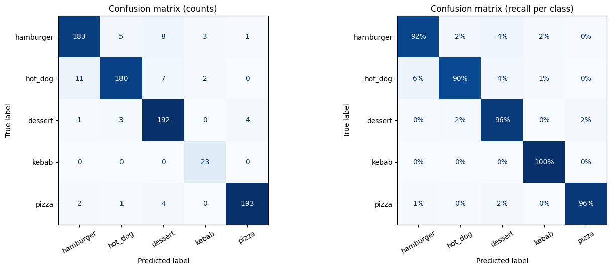
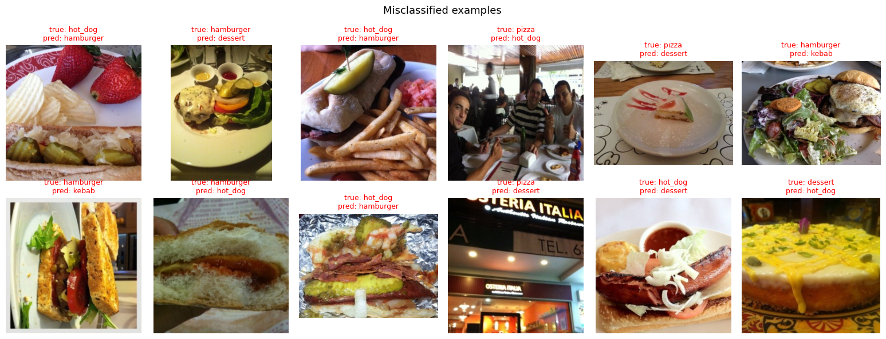

# Computer Vision Projects

Hands-on computer vision work with **PyTorch** and **OpenCV**: a food image classifier trained with transfer learning, a data-cleaning pipeline for web-scraped images, and real-time webcam face detection.

## 1. Menu Detector — Food Image Classifier

Classifies a food photo into 5 classes: **hamburger, hot dog, dessert, kebab, pizza**.

| | |
|---|---|
| Model | MobileNetV2 (ImageNet-pretrained), fine-tuned |
| Data | 4,113 images — Food-101 subsets + web-scraped kebab images |
| Validation accuracy | **93.7%** |
| Balanced accuracy | **94.8%** (mean per-class recall) |
| Kebab recall | **100%** (minority class, 113 images) |

**What makes it work**
- **Class imbalance handling** — kebab has ~9x fewer images than other classes; class-weighted loss, stratified split and capping the merged dessert class keep every class visible to the model.
- **Data augmentation** — random crop, flip, rotation and color jitter.
- **Per-epoch validation with best-checkpoint selection** — training accuracy kept rising after epoch 5 while validation loss increased (overfitting), so the epoch-5 model was kept.
- **Full evaluation** — confusion matrix, per-class precision/recall/F1, and galleries of correct and misclassified predictions.

| Class | Precision | Recall | F1 |
|---|---|---|---|
| hamburger | 0.929 | 0.915 | 0.922 |
| hot_dog | 0.952 | 0.900 | 0.925 |
| dessert | 0.910 | 0.960 | 0.934 |
| kebab | 0.821 | 1.000 | 0.902 |
| pizza | 0.975 | 0.965 | 0.970 |






Most errors happen between visually similar "bread + meat" dishes (hamburger / hot dog / kebab) or in dark, cluttered photos.

**Notebook:** [`menu_detector_model.ipynb`](menu_detector_model.ipynb) — runs on Google Colab (T4 GPU), includes an upload-and-predict demo.

## 2. Data Scraping & CLIP Filtering

Food-101 has no kebab class, so kebab images were scraped from Bing. About **90% of the scraped images were unrelated noise** (logos, ads, people), so the pipeline filters them automatically:

1. Remove broken, tiny and near-duplicate images (perceptual hashing)
2. **CLIP zero-shot filtering** — score each image as "kebab" vs. logo / person / building / drawing
3. Quick manual review, then copy approved images to the dataset

478 raw images → 466 after de-duplication → 36 passed CLIP → **24 approved**.

**Notebook:** [`data_scraping.ipynb`](data_scraping.ipynb)

## 3. Real-time Face Detection (Webcam)

OpenCV Haar Cascade face detection on a live webcam stream with mirrored view, face counter and FPS overlay — runs at **~30 FPS** on a MacBook and detects multiple faces.

```bash
python3 -m venv .venv
source .venv/bin/activate
pip install -r requirements.txt
python face_detection_webcam.py   # press "q" to quit
```

> Note: OpenCV 5.x removed the Haar Cascade classifier, so `requirements.txt` pins OpenCV 4.x.

## Learning notebooks

| Notebook | Topic |
|---|---|
| `cv_opencv.ipynb` | OpenCV basics: grayscale, resize, crop, rotate, flip |
| `pytorch.ipynb` | First PyTorch model: linear regression |
| `matplotlib.ipynb` | Plotting practice |

## Tech stack

Python · PyTorch · torchvision · scikit-learn · OpenCV · Hugging Face Transformers (CLIP) · pandas · Matplotlib · Google Colab
