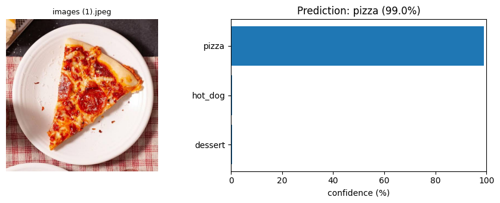
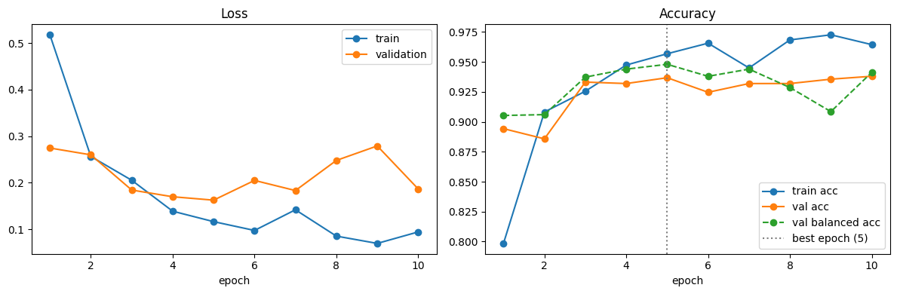

# Menu Detector

## 1. Menu Detector — Food Image Classifier

Classifies a food photo into 5 classes: **hamburger, hot dog, dessert, kebab, pizza**.

### Results

| Metric | Value |
|---|---|
| Validation accuracy | **93.7%** |
| Balanced accuracy (mean per-class recall) | **94.8%** |
| Kebab recall — the smallest class | **100%** |
| Dataset | 4,113 images, stratified 80/20 split |
| Model | MobileNetV2 (ImageNet-pretrained), fine-tuned |
| Training | 10 epochs, ~3 minutes on a T4 GPU |

| Class | Precision | Recall | F1 |
|---|:---:|:---:|:---:|
| hamburger | 0.929 | 0.915 | 0.922 |
| hot_dog | 0.952 | 0.900 | 0.925 |
| dessert | 0.910 | 0.960 | 0.934 |
| kebab | 0.821 | 1.000 | 0.902 |
| pizza | 0.975 | 0.965 | 0.970 |

### Highlights

- **Class imbalance handling** — kebab had about 9× fewer images than the other classes. A class-weighted loss, a stratified split, data augmentation and capping the merged dessert class keep every class visible to the model, and the best checkpoint is chosen by **balanced accuracy** instead of plain accuracy.
- **Overfitting caught by per-epoch validation** — after epoch 5 training accuracy kept rising while validation loss increased, so the epoch-5 checkpoint was kept.
- **Transfer learning** — the backbone learns slowly (lr 1e-4) to keep its ImageNet knowledge, while the new 5-class head learns 10× faster (lr 1e-3).
- **Rebuilt from a course version** — the original notebook reached 89% but had an empty class, validation code outside the training loop and no augmentation. Seven problems were found and fixed.

| Training curves | Confusion matrix |
|---|---|
|  |  |

**Where the model struggles:** most errors are between visually similar "bread + meat" dishes (hamburger / hot dog / kebab) and in dark or cluttered photos.

**Notebook:** [`menu_detector_model.ipynb`](menu_detector_model.ipynb)

## 2. Data Scraping & CLIP Filtering

Food-101 has no kebab class, so kebab images were scraped from Bing. About **90% of them turned out to be unrelated noise** — ads, logos, maps and photos of people — so they were cleaned in three layers:

1. **Technical filter** — broken, tiny and near-duplicate images removed with perceptual hashing (also against images already in the dataset)
2. **CLIP zero-shot filter** — each image scored as "kebab" vs. logo / person / building / drawing
3. **Manual review** of the remaining images, sorted from least to most confident

| Stage | Images |
|---|---:|
| Raw download | 478 |
| After de-duplication | 466 |
| CLIP score ≥ 0.8 | 36 |
| After manual review | **24** |

**Notebook:** [`data_scraping.ipynb`](data_scraping.ipynb)

## Run in Colab

Open the notebook and select a T4 GPU. Set `DRIVE_ROOT` to your own Google Drive location and provide Food-101 subsets plus cleaned kebab images. Dataset and weights are not included. Run cells in order, then use upload-and-predict. For scraping, follow the installation cell in `data_scraping.ipynb`.

## Evaluation scope

Results use 3,290 training and 823 validation images (seed 42). The 100% kebab recall covers only 23 validation images. Checkpoint selection uses this same validation split; there is no separate held-out test result. Balanced accuracy differs from overall accuracy; neither is a guarantee for new photos.

[Back to all projects](../README.md)

